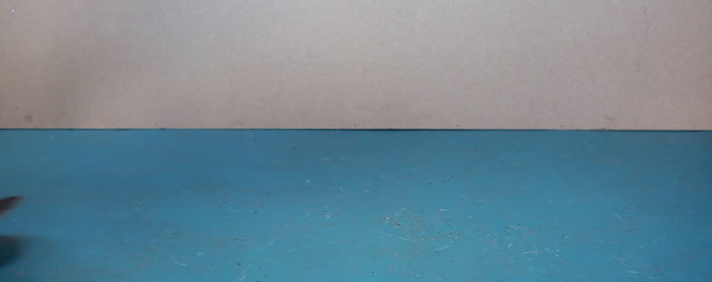

# motionFrame

[demo here](http://benbyford.com/experiments/tiltmotion/)

Usage:
---------------------

`

  
  
  
  ... any number of images here

`

add images to `/imgs/` and imclude .js file to your project
